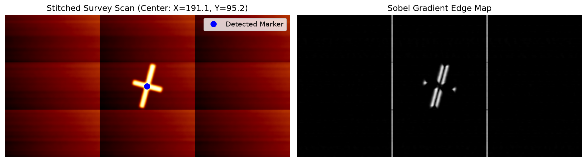
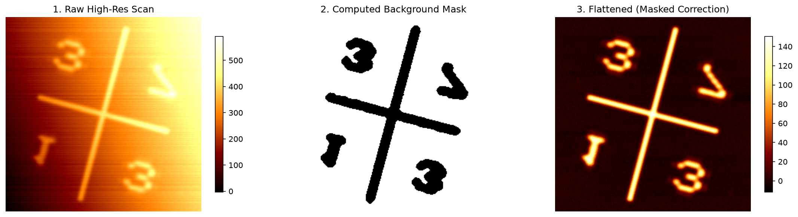
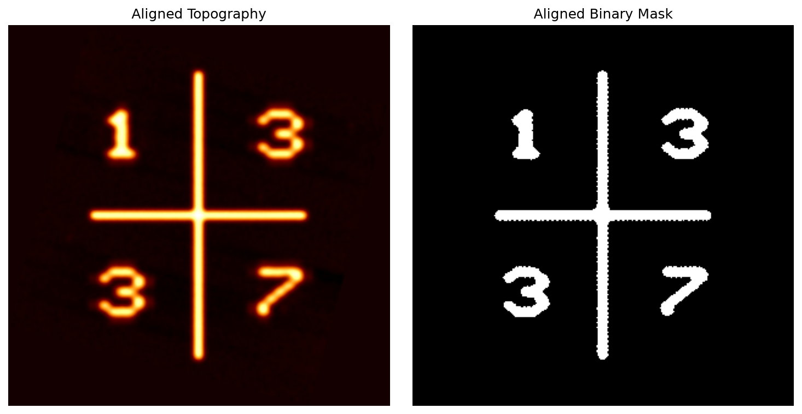
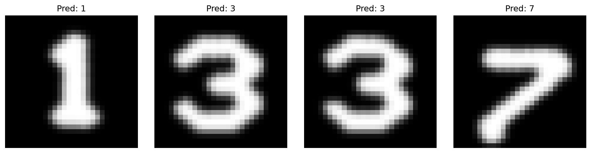
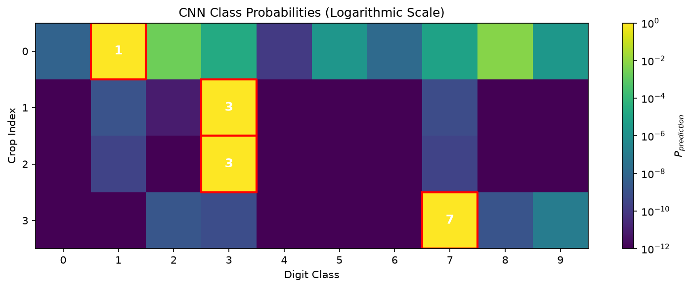

# Automated Atomic Force Microscopy (AFM) Data Processing Pipeline

An end-to-end computer vision and deep learning pipeline for automated navigation, artifact correction, and feature extraction in Atomic Force Microscopy (AFM).

This repository contains the upgraded and refactored implementation of a university laboratory project developed during the "Data Science Aided Measurements" course at the Budapest University of Technology and Economics (BME). The primary objective is to translate raw, nanometer-resolution surface topography measurements into actionable physical coordinate data using data science methodologies.

## Background & Motivation

Modern Atomic Force Microscopes (such as the Semilab AFM-1000) generate vast amounts of topographical data that require efficient and automated evaluation. When scanning semiconductor wafers or large biological samples, navigating to specific regions of interest at the nanoscale is a significant challenge. Samples are often fabricated with microscopic identification markers (e.g., numerical digits) acting as coordinate references.

**Note on Data Availability:** 
The original raw measurement files and sample topographies collected during the laboratory sessions are subject to a Non-Disclosure Agreement (NDA). Consequently, real measurement data and their corresponding visualisations cannot be published. To ensure this repository remains fully reproducible, testable, and publicly accessible, a highly realistic **Synthetic AFM Data Generator** has been implemented. This module simulates real-world AFM artifacts including bicubic tip convolution, PID feedback shadowing, substrate tilt, piezo cross-talk, and surface debris, allowing the pipeline to be demonstrated without compromising confidential data.

---

## Pipeline Architecture

The system is divided into three distinct phases, seamlessly executed via a single command-line interface.

### Phase 1: Macroscopic Navigation
To locate the microscopic marker, the system processes a 3x3 grid of survey scans. The individual arrays are Z-aligned and stitched into a single continuous macroscopic surface map. A Sobel gradient filter combined with morphological operations is then applied to suppress horizontal scan artifacts and isolate the geometric centroid of the navigation marker.


*Left: Assembled survey scan with detected marker centroid. Right: Sobel gradient edge map used for robust detection.*

### Phase 2: Nanoscale Data Processing & Correction
Once a high-resolution scan is acquired at the detected centroid, the data must be cleaned. AFM images inherently contain artifacts from sample tilt and the raster-scanning nature of the piezoelectric actuators. 

The pipeline computes a structural mask using image gradients and Otsu's thresholding to separate the physical foreground from the flat background. Using this mask, a least-squares plane fit and a line-by-line polynomial correction are applied exclusively to the background, flattening the image without distorting the structural data.


*1. Raw scan containing tilt and piezo line artifacts. 2. Computed background mask. 3. Flattened scan after masked mathematical correction.*

Following artifact correction, the image undergoes morphological segmentation (erosion, dilation, hole filling) and geometric alignment. The dominant orientation of the marker is calculated, and the scan is rotated and mirrored to a normalized perspective.


*Left: Geometrically aligned topography. Right: Clean binary mask ready for digit extraction.*

### Phase 3: Deep Learning Inference
The segmented digits are extracted in reading order based on bounding box coordinates. Because the model was trained on the standard MNIST dataset, the raw AFM data must be heavily preprocessed to match MNIST distributions. This involves aspect-ratio-preserving rescaling, center-of-mass translation, Gaussian blurring to simulate stroke gradients, and critical vertical inversion (as AFM origin coordinates differ from standard image matrices).

A Convolutional Neural Network (CNN) processes the normalized crops and outputs class probabilities. The final predicted string is translated into absolute physical chip coordinates.




*Top: Preprocessed AFM digit crops aligned for the CNN. Bottom: Class probability heatmap displayed on a logarithmic scale.*

---

## Installation & Requirements

The project is built using Python 3 and standard data science libraries.

```bash
# Clone the repository
git clone https://github.com/yourusername/afm-automated-pipeline.git
cd afm-automated-pipeline

# Install required packages
pip install numpy scipy scikit-image tensorflow matplotlib gwyfile
```

*(Note: `gwyfile` is only required if you intend to parse proprietary `.safm` files. The synthetic pipeline relies purely on standard `.npy` arrays).*

---

## Usage Guide

### 1. Generating Synthetic Data
To test the pipeline without proprietary data, use the synthetic generator. You can specify the 4-digit marker string you want to simulate (e.g., `1337`).

```bash
python scripts/generate_synthetic_afm.py --digits 1337 --output data/raw/synthetic
```
This script will output nine `Task_2.0_X.Y_scan1.npy` survey tiles and one `Task_3.6_synthetic_highres.npy` high-resolution scan into the specified directory, complete with simulated measurement noise.

### 2. Running the Processing Pipeline
Execute the main pipeline by pointing it to the survey directory, the high-resolution file, and the pre-trained CNN model. 

```bash
python main.py \
    --survey-dir data/raw/synthetic \
    --highres data/raw/synthetic/Task_3.6_synthetic_highres.npy \
    --model models/mnist_cnn_model.h5 \
    --save-plots docs/images/test_synthetic
```

**Expected Console Output:**
```text
--- PHASE 1: MACROSCOPIC NAVIGATION ---
[*] Stitching survey scans from: data/raw/synthetic
[*] Detecting marker centroid via Sobel gradients...
    -> Marker Centroid found at pixel (X: 96.0, Y: 96.0)

--- PHASE 2: NANOSCALE DATA PROCESSING ---
[*] Loading high-resolution scan: data/raw/synthetic/Task_3.6_synthetic_highres.npy
[*] Performing Masked Artifact Correction (Plane & Line)...
[*] Morphological Segmentation & Geometric Alignment...
    -> Found 4 structural digits.

--- PHASE 3: DEEP LEARNING INFERENCE ---
[*] Preprocessing digits (Center-of-Mass alignment)...
==================================================
PREDICTED AFM MARKER STRING: 1337
CHIP COORDINATES DEDUCED: X = 2600 µm, Y = 7400 µm
==================================================
```

---

## Repository Structure

```text
├── data/
│   └── raw/synthetic/          # Generated simulated AFM data (.npy)
├── docs/
│   └── images/                 # Output visualisations and pipeline debug plots
├── models/
│   └── mnist_cnn_model.h5      # Pre-trained Keras model for digit classification
├── scripts/
│   └── generate_synthetic_afm.py # Synthetic AFM topology simulator
├── src/
│   ├── correction.py           # Plane and line-by-line masked corrections
│   ├── image_ops.py            # Gradient masking, thresholding, and alignments
│   ├── inference.py            # MNIST preprocessing and CNN wrapper
│   ├── navigation.py           # Multi-scan stitching and centroid detection
│   ├── parser.py               # .safm (Gwyddion) and .npy data loaders
│   └── visualize.py            # Matplotlib plotting routines
├── main.py                     # Primary CLI application
└── README.md
```

## Acknowledgments
* **Institution:** Budapest University of Technology and Economics (BME).
* **Course:** Measurement Exercise for Physicist-Engineer Students - Automated AFM data acquisition and processing.
* **Hardware Context:** Semilab AFM-1000.